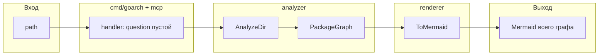
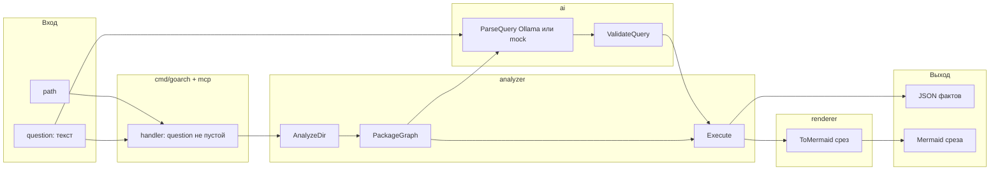

# GoArch Visualizer — план работ

> **Единый источник истины** для разработки и handoff между машинами.  
> Обновляй этот файл при завершении задачи или смене фокуса.

---

## Как работать с агентом

Скопируй в новый чат на любой машине:

```
Читай docs/PLAN.md в репозитории goarch-visualizer.
Остановился на задаче <ID>. Продолжаем её.
Не меняй код и не запускай команды без моей явной команды («примени», «запусти»).
```

Примеры:

- `Остановился на задаче C-01. Продолжаем.`
- `Задача C-01 done. Переключаемся на C-02.`
- `Покажи статус по docs/PLAN.md, что дальше?`

**Связанные файлы:**

| Файл | Назначение |
|------|------------|
| `docs/PLAN.md` | план, задачи, решения, текущий фокус |
| `readme.md` | публичное описание, установка, demo |
| `.cursor/mcp.json` | project-level MCP (может не подхватываться Cursor) |
| `~/.cursor/mcp.json` | **глобальный MCP** (рабочий вариант на Mac) |
| `~/.cursor/permissions.json` | allowlist для `analyze_project` |

---

## Текущий фокус

| Поле | Значение |
|------|----------|
| **Стратегия** | Text-to-graph query: вопрос → `{op, ids}` → Go обходит граф → срез Mermaid |
| **Активная задача** | `C-01` — `Execute` в `internal/analyzer/query.go` (без LLM) |
| **Фаза** | 1 — query поверх package graph |
| **Обновлено** | 2026-09-21 (диаграммы двух потоков зафиксированы) |
| **Блокеры** | нет |

---

## Продуктовое решение (зафиксировано)

AI внутри MCP **парсит вопрос** в чёткий `{op, target, …}`. Ответ по архитектуре считает **анализатор графа** (`Execute`), не модель.

**Не делаем:** линтер слоёв, раскраску ok/warning как смысл AI, recommendations.

Claude в чате Cursor — host (может болтать про схему). Это не `internal/ai`. Ollama в goarch — только шаг «текст → Query».

### Модули и ответственность

| Модуль | Пакет | Вход | Выход | За что отвечает |
|--------|-------|------|-------|-----------------|
| **MCP / CLI** | `internal/mcp`, `cmd/goarch` | `path`, optional `question` | текст клиенту | принять вызов, выбрать поток, ничего не считать |
| **Analyzer (граф)** | `internal/analyzer` `AnalyzeDir`, `PackageGraph` | путь к Go-модулю | `Graph` пакетов и import-рёбер | факты из кода |
| **AI** | `internal/ai` ParseQuery (Ollama/mock) | PackageGraph + строка вопроса | `Query` `{op, target, from, to, exclude_prefix}` | **распарсить запрос**, не искать по рёбрам |
| **Validate** | `internal/ai` ValidateQuery | Graph + Query | тот же Query или error | id существуют, op из enum |
| **Execute** | `internal/analyzer` query.go | Graph + Query | срез `Graph` | обход рёбер, окончательный факт |
| **Renderer** | `internal/renderer` | `Graph` | строка Mermaid | только рисунок |

---

### Поток A — без вопроса (только схема)

LLM **не вызывается**.

**Вход MCP/CLI:** `{ "path": "/Users/ermakov/GO/bookings" }`

**Выход:** `graph LR` всего модуля (package graph).



AI в этом потоке нет.

---

### Поток B — с вопросом (парсинг AI + ответ анализатора)

**Вход MCP/CLI:**

```json
{
  "path": "/Users/ermakov/GO/bookings",
  "question": "кто импортирует dto кроме http"
}
```

**Выход AI (не пользователю):** `{ "op": "dependents", "target": "…/dto", "exclude_prefix": ["…/adapter/http"] }`

**Выход MCP пользователю:** JSON фактов (список пакетов/рёбер) + Mermaid **среза**.



| Шаг | Модуль | Вход | Выход |
|-----|--------|------|-------|
| 1 | analyzer | `path` | полный `Graph` |
| 2 | analyzer | `Graph` | только packages + import edges |
| 3 | **ai** | packages + `question` | `Query` (операция и id) |
| 4 | ai Validate | `Query` + граф | валидный `Query` или ошибка |
| 5 | analyzer Execute | граф + `Query` | срез графа = **ответ** |
| 6 | renderer | срез | Mermaid |

### Операции (enum)

| `op` | Вопрос пользователя | Что считает Go |
|------|---------------------|----------------|
| `dependents` | кто импортирует X | входящие рёбра |
| `dependencies` | что импортирует X | исходящие рёбра |
| `path` | есть ли связь A→…→B | BFS/DFS |
| `neighbors` | что рядом с X | hop=1 |

### Контракт данных

**MCP вход с вопросом:**

```json
{
  "path": "/Users/ermakov/GO/bookings",
  "question": "кто импортирует dto кроме http"
}
```

**Выход LLM (только это):**

```json
{
  "op": "dependents",
  "target": "github.com/coffee22coder/bookings/internal/adapter/http/dto",
  "exclude_prefix": ["github.com/coffee22coder/bookings/internal/adapter/http"]
}
```

**Выход Go / MCP:** JSON фактов + Mermaid только этих узлов/рёбер.

**Без question:** только `graph LR` всего модуля, 0 вызовов Ollama.

---

## Зафиксированные решения

Не менять без явного обсуждения.

| # | Решение | Почему |
|---|---------|--------|
| D-01 | **AI внутри Go** (`interface` на ParseQuery), один pipeline CLI+MCP | не два round-trip через Cursor для query |
| D-02 | **Claude API не обязателен** | Ollama дома, mock для тестов query без сети |
| D-03 | **Package ID = import path** | `sample/internal/service`, не `pkg:service` |
| D-04 | **Mermaid рисует только packages** | funcs/types в графе есть, но не на диаграмме |
| D-05 | **Ollama получает `PackageGraph`** | полный граф (funcs/types) → timeout |
| D-06 | **Validate отсекает чужие node ID** | LLM не имеет права вернуть id вне графа |
| D-07 | **MVP = text-to-graph query, не lint** | уникальность vs godepgraph; не arch-go |
| D-08 | **`go/packages` — после MVP** | WalkDir + module.go достаточно для demo |
| D-09 | **Execute живёт в `analyzer`, не в `ai`** | обход графа детерминированный, без LLM |
| D-10 | **Пустой question → LLM не вызывать** | схема должна быть мгновенной |

---

## Pipeline — статус компонентов

```
AnalyzeDir → PackageGraph
    ├─ question == ""  → ToMermaid(весь граф)
    └─ question != ""  → ParseQuery (LLM/mock) → ValidateQuery → Execute → ToMermaid(срез)
```

| Компонент | Путь | Статус | Примечание |
|-----------|------|--------|------------|
| Graph model | `internal/analyzer/graph.go` | ✅ | Nodes, Edges, PackageGraph |
| Module resolve | `internal/analyzer/module.go` | ✅ | go.mod, import path |
| AST parse | `internal/analyzer/ast.go` | ✅ | packages, funcs, types, imports |
| WalkDir loader | `internal/analyzer/dir.go` | ✅ | skip vendor, _test.go |
| **Query Execute** | `internal/analyzer/query.go` | ❌ | **C-01** |
| go/packages loader | — | ❌ | фаза 2, D-01 |
| Mock ParseQuery | `internal/ai/mock.go` | 🟡 | сейчас красит ok; переписать |
| Ollama ParseQuery | `internal/ai/ollama.go` | 🟡 | сейчас status JSON; переписать |
| Claude API | — | ❌ | не в MVP |
| RuleAnalyzer | — | ❌ | **отменено** (линтер) |
| Validate | `internal/ai/validate.go` | 🟡 | сейчас статусы; → ValidateQuery |
| Mermaid | `internal/renderer/mermaid.go` | ✅ | safeId: `/`, `:`, `.` |
| MCP `analyze_project` | `internal/mcp/server.go` | 🟡 | нет `question` |
| CLI | `cmd/goarch/main.go` | 🟡 | нет аргумента question |

Легенда: ✅ готово · 🟡 есть, надо переписать · ❌ не начато

---

## План изменений по файлам (итерация query)

### Не трогать

- `internal/analyzer/ast.go`
- `internal/analyzer/dir.go`
- `internal/analyzer/module.go`
- `internal/analyzer/graph.go` (`PackageGraph` уже есть)
- `cmd/inspect/main.go`
- `testdata/sample-project/**` (только как фикстура тестов)

### Новые файлы

| Файл | Зачем |
|------|--------|
| `internal/analyzer/query.go` | `Op`, `Query`, `Execute(g, q) (*Graph, error)` |
| `internal/analyzer/query_test.go` | dependents/path на sample-project |

### Менять

| Файл | Что сделать |
|------|-------------|
| `internal/ai/types.go` | Query JSON вместо Analysis/statuses в hot path |
| `internal/ai/analyzer.go` | `ParseQuery(ctx, g, question) (analyzer.Query, error)` вместо `Analyze → Analysis` |
| `internal/ai/validate.go` | `ValidateQuery(g, q)` — enum op, id ∈ графа, обязательные поля |
| `internal/ai/ollama.go` | промпт: только schema Query; вход = PackageGraph + question |
| `internal/ai/mock.go` | эвристика по тексту вопроса для тестов без Ollama |
| `internal/renderer/mermaid.go` | рисовать срез; для MVP можно `ToMermaid(g, Analysis{})` |
| `internal/mcp/server.go` | optional `question`; пусто → без LLM |
| `cmd/goarch/main.go` | `analyze <path> [question...]` |
| `readme.md` | param `question`, два примера |

### Порядок реализации (не прыгать через шаг)

1. **C-01** `query.go` + тесты (без AI).
2. **C-02** `ValidateQuery`.
3. **C-03** переписать `Analyzer` / ollama / mock на ParseQuery.
4. **C-04** склеить MCP + CLI.
5. **C-05** README.

Пока C-01 не зелёный — Ollama в новый контракт не подключать.

---

## Бэклог задач

### Фаза 0 — Инфраструктура ✅

| ID | Задача | Статус | DoD |
|----|--------|--------|-----|
| A-01 | Graph + AST + import path ID | ✅ | тесты зелёные, edges сходятся |
| A-02 | MCP tool `analyze_project` | ✅ | Cursor видит tool |
| A-03 | CLI `analyze <path>` | ✅ | Mermaid в stdout |
| A-04 | AI interface + Mock + Ollama | ✅ | старый контракт Analysis; будет переписан |
| A-05 | Validate статусов | ✅ | будет заменён ValidateQuery |
| A-06 | Mermaid + classDef | ✅ | |
| A-07 | PackageGraph для Ollama | ✅ | bookings без timeout |
| A-08 | safeId (точки) | ✅ | |
| A-09 | MCP в Cursor | ✅ | global mcp.json, allowlist |
| A-10 | README | ✅ | обновить на C-05 |

---

### Фаза 1 — Text-to-graph query 🔄

| ID | Задача | Статус | Файлы | DoD |
|----|--------|--------|-------|-----|
| **C-01** | **Execute query** | 🔄 **активная** | `internal/analyzer/query.go`, `query_test.go` | dependents/path на sample-project |
| C-02 | ValidateQuery | ⬜ | `internal/ai/validate.go` | чужой id → error |
| C-03 | ParseQuery: mock + ollama | ⬜ | `analyzer.go`, `mock.go`, `ollama.go`, `types.go` | LLM не возвращает список пакетов, только Query |
| C-04 | MCP + CLI pipeline | ⬜ | `internal/mcp/server.go`, `cmd/goarch/main.go` | пустой question = без LLM |
| C-05 | Docs | ⬜ | `readme.md` | примеры question |
| C-06 | Demo bookings | ⬜ | — | «кто импортирует dto кроме http» → port, service, postgres |

**Definition of Done фазы 1:**

- [ ] `go test ./internal/analyzer/` — Execute зелёный
- [ ] CLI без question — мгновенный полный Mermaid
- [ ] CLI с question + mock — срез без Ollama
- [ ] CLI с question + `GOARCH_AI=ollama` — тот же срез на sample-project
- [ ] MCP param `question` optional
- [ ] LLM не вызывается, если question пустой

---

### Фаза 2 — Качество графа (после query)

| ID | Задача | Статус | DoD |
|----|--------|--------|-----|
| D-01 | Loader `go/packages` | ⬜ | build tags |
| D-02 | Читаемые Mermaid labels | ⬜ | `[internal/domain]` не `[main]` |
| D-03 | Timeout HTTP Ollama | ⬜ | не висеть бесконечно |

---

### Фаза 3 — отложено

| ID | Задача | Статус | Почему отложено |
|----|--------|--------|-----------------|
| ~~RuleAnalyzer~~ | lint слоёв | ❌ | не продукт; arch-go |
| E-01 | Claude API как ParseQuery | ⬜ | после стабильного ollama |
| F-02 | HTML report | ⬜ | не MVP |
| Impact / changed_files | идея 3 | ⬜ | после query |
| Task → subgraph radius | идея 2 | ⬜ | после query |

---

## Задача C-01 — детали (активная)

**Цель:** детерминированный обход package graph. Без Ollama.

```go
type Op string // dependents | dependencies | path | neighbors

type Query struct {
    Op            Op
    Target        NodeID
    From, To      NodeID
    ExcludePrefix []string
}

func Execute(g *Graph, q Query) (*Graph, error)
```

Работать на `PackageGraph(g)`.

**Тесты (`query_test.go`), фикстура `testdata/sample-project`:**

- dependents от `sample/internal/service` → пакет `sample/cmd/app`
- path `sample/cmd/app` → `sample/internal/service` → found, 1 ребро
- path в обратную сторону → not found / пустой граф (как решите в API, зафиксировать в тесте)

**Не делать в C-01:** MCP, ollama, смена `Analyzer`.

---

## Окружение

### Переменные

| Env | Значения | Default | Когда LLM |
|-----|----------|---------|-----------|
| `GOARCH_AI` | `mock`, `ollama` | `mock` | только если передан `question` |

После C-04: `mock` парсит простые фразы; `ollama` — полный NL.

### MCP (`~/.cursor/mcp.json`)

```json
{
  "mcpServers": {
    "goarch-visualizer": {
      "command": "go",
      "args": ["run", "-C", "/ABS/PATH/goarch-visualizer", "./cmd/goarch"],
      "env": { "GOARCH_AI": "ollama" }
    }
  }
}
```

`GOARCH_AI=ollama` не должен вызывать модель на запросе без `question`.

### Allowlist

```json
{
  "mcpAllowlist": ["goarch-visualizer:analyze_project"]
}
```

### Ollama

```bash
ollama pull qwen2.5-coder:7b
ollama serve
```

---

## Тестовые проекты

| Path | Назначение | Ожидание |
|------|------------|----------|
| `testdata/sample-project` | Execute + mock query | 2 packages, 1 edge |
| `/Users/ermakov/GO/bookings` | demo «dto кроме http» | port, service, postgres |

---

## Журнал прогресса

| Дата | Задача | Что сделано |
|------|--------|-------------|
| 2026-09-07 | A-01..A-04 | analyzer, AI interface, Ollama smoke |
| 2026-09-15 | A-02, A-09 | MCP в Cursor |
| 2026-09-16 | A-06, A-07 | Mermaid в MCP, Ollama env |
| 2026-09-17 | A-07, A-08 | PackageGraph, safeId |
| 2026-09-17 | A-10 | README; первый PLAN (RuleAnalyzer) |
| 2026-09-21 | — | Стратегия сменена на text-to-graph query; PLAN переписан; фокус C-01 Execute |
| 2026-09-21 | — | Зафиксированы две диаграммы потоков (с вопросом / без); AI = парсер вопроса |

---

## Что явно НЕ в плане

- RuleAnalyzer / arch lint как MVP
- Два round-trip AI через Cursor для построения графа
- MCP sampling
- Отправка funcs/types/AST в LLM
- Claude API как requirement
- LLM генерирует весь Mermaid или список пакетов в обход Execute

---

## Быстрая проверка

```bash
# 1. Граф + (после C-01) query
go test ./internal/analyzer/...

# 2. Схема без вопроса (после C-04 — без Ollama)
go run ./cmd/goarch analyze testdata/sample-project

# 3. Query (после C-04)
go run ./cmd/goarch analyze testdata/sample-project кто импортирует service

# 4. MCP
# «Вызови analyze_project path=.../sample-project»
# «… path=.../bookings question=кто импортирует dto кроме http»
```
