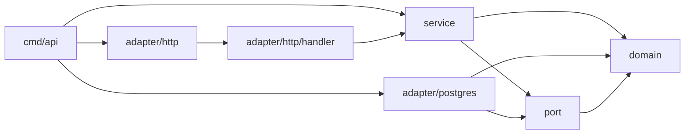

# goarch-visualizer

Анализатор архитектуры Go-проектов с интеграцией в AI-агенты через **MCP** (Model Context Protocol).

Строит граф зависимостей пакетов по AST, прогоняет его через анализатор (локальная LLM или правила) и отдаёт **Mermaid-диаграмму** с цветовой разметкой состояния пакетов.

Главная идея: **агент в Cursor/Claude видит архитектуру проекта целиком**, а не по кусочкам через чтение файлов.

> **План разработки и handoff:** [`docs/PLAN.md`](docs/PLAN.md)  
> Актуальный фокус: text-to-graph query (`question` → операция над графом), не линтер слоёв.

---

## Демо

Запрос агенту:

> Вызови `analyze_project` с path `/path/to/my-go-service`

Ответ — готовая диаграмма:



Цвета в реальном выводе:

| Цвет       | Статус    | Значение              |
| ---------- | --------- | --------------------- |
| 🟢 зелёный | `ok`      | нарушений не найдено  |
| 🟡 жёлтый  | `warning` | спорная зависимость   |
| 🔴 красный | `error`   | нарушение архитектуры |

---

## Зачем это нужно

| Проблема                                                | Как решает goarch-visualizer           |
| ------------------------------------------------------- | -------------------------------------- |
| Агент читает файлы по одному и не видит картину целиком | Отдаёт весь граф пакетов одним вызовом |
| «Как устроен этот проект?» — долго объяснять            | Одна диаграмма вместо десяти абзацев   |
| Нарушения слоёв всплывают на code review                | Видны на графе до ревью                |
| Онбординг нового разработчика                           | Визуальная карта модуля за секунду     |

---

## Как это работает

```
Go-проект
   │
   ▼
go.mod → определение module path            (internal/analyzer/module.go)
   │
   ▼
walk по .go файлам, парсинг AST              (internal/analyzer/ast.go)
   │  собирает: packages, funcs, types, imports
   ▼
Graph{Nodes, Edges}                          (internal/analyzer/graph.go)
   │
   ▼
Analyzer.Analyze() → статусы пакетов         (internal/ai/)
   │  реализации: MockAnalyzer | OllamaAnalyzer
   ▼
Validate() — отсев несуществующих node ID    (internal/ai/validate.go)
   │  защита от галлюцинаций LLM
   ▼
ToMermaid() → диаграмма                      (internal/renderer/mermaid.go)
   │
   ▼
MCP stdio ──► AI-агент (Cursor / Claude)     (internal/mcp/server.go)
```

Ключевая деталь: **`Validate` выбрасывает любые узлы, которых нет в реальном графе**. LLM не может придумать несуществующий пакет — его вердикт просто отбросится.

---

## Установка

```bash
git clone https://github.com/coffee22coder/goarch-visualizer
cd goarch-visualizer
go build -o bin/goarch ./cmd/goarch
```

Требования: Go 1.26+

---

## Использование

### 1. CLI

```bash
go run ./cmd/goarch analyze /path/to/go/project
```

Вывод — Mermaid-разметка в stdout. Вставляется в GitHub README, Obsidian, mermaid.live.

### 2. MCP-сервер (основной режим)

Без аргументов бинарь стартует как MCP-сервер на stdio:

```bash
./bin/goarch
```

#### Подключение к Cursor

Глобальный конфиг `~/.cursor/mcp.json`:

```json
{
  "mcpServers": {
    "goarch-visualizer": {
      "command": "/absolute/path/to/goarch-visualizer/bin/goarch"
    }
  }
}
```

Или без сборки бинаря, через `go run`:

```json
{
  "mcpServers": {
    "goarch-visualizer": {
      "command": "go",
      "args": [
        "run",
        "-C",
        "/absolute/path/to/goarch-visualizer",
        "./cmd/goarch"
      ]
    }
  }
}
```

> ⚠️ Флаг `-C` обязателен. Без него `go run` стартует из чужого рабочего каталога и падает с `go.mod file not found`.

После сохранения: **Customize → MCPs** → сервер должен загореться зелёным, в списке появится tool `analyze_project`.

#### Проверка

Напишите агенту:

```
Вызови analyze_project с path: /path/to/your/go/project
```

---

## MCP API

### `analyze_project`

| Параметр | Тип    | Обязательный | По умолчанию | Описание                                                  |
| -------- | ------ | ------------ | ------------ | --------------------------------------------------------- |
| `path`   | string | да           | —            | Абсолютный путь к Go-проекту (внутри модуля с `go.mod`)   |
| `level`  | number | нет          | `2`          | Глубина анализа _(зарезервировано, пока не используется)_ |

**Возвращает:** текст с Mermaid-диаграммой.

**Пример вызова:**

```json
{
  "path": "/Users/me/GO/bookings"
}
```

**Пример ответа:**

```
graph LR
classDef ok fill:#d4edda,stroke:#28a745,color:#000
classDef warning fill:#fff3cd,stroke:#ffc107,color:#000
classDef error fill:#f8d7da,stroke:#dc3545,color:#000
sample_cmd_app[main]
sample_internal_service[service]
class sample_cmd_app ok
class sample_internal_service ok
sample_cmd_app-->sample_internal_service
```

---

## Анализаторы

Выбор через переменную окружения `GOARCH_AI` (поддерживается `.env`):

| Значение      | Анализатор       | Требования                                             |
| ------------- | ---------------- | ------------------------------------------------------ |
| _(не задано)_ | `MockAnalyzer`   | нет — работает офлайн                                  |
| `ollama`      | `OllamaAnalyzer` | Ollama на `localhost:11434`, модель `qwen2.5-coder:7b` |

### Локальная LLM (Ollama)

```bash
ollama pull qwen2.5-coder:7b
ollama serve
```

```bash
# .env
GOARCH_AI=ollama
```

Весь анализ идёт **локально**. Код проекта никуда не отправляется.

### Свой анализатор

Интерфейс минимальный:

```go
type Analyzer interface {
    Analyze(ctx context.Context, g *analyzer.Graph, focus string) (*Analysis, error)
}
```

Реализуйте его — и подключите в `cmd/goarch/main.go`. Никаких изменений в парсере и рендере не требуется.

---

## Текущий статус

Проект в активной разработке. Что реально работает, а что нет:

**Готово:**

- ✅ Парсинг AST: пакеты, функции, типы, импорты
- ✅ Резолв import path через `go.mod` (включая вложенные пакеты)
- ✅ Построение и дедупликация графа
- ✅ Рендер в Mermaid с классами статусов
- ✅ MCP-сервер на stdio, работает в Cursor
- ✅ CLI-режим
- ✅ Защита от галлюцинаций LLM (`Validate`)
- ✅ Пропуск `vendor/` и `_test.go`

**Не готово / ограничения:**

- ⚠️ **`MockAnalyzer` не проверяет правила** — он ставит `ok` всем пакетам безусловно. Зелёный граф означает «проверок не было», а не «нарушений нет». Реальная валидация слоёв — в работе.
- ⚠️ Детекция циклических зависимостей не реализована
- ⚠️ Параметр `level` принимается, но игнорируется
- ⚠️ Рёбра типа `call` и `implement` объявлены в модели, но не собираются
- ⚠️ На больших монорепах граф нечитаем — нет группировки и фильтров
- ⚠️ `Recommendations` из `Analysis` не попадают в вывод MCP
- ⚠️ Внешние зависимости (не из модуля) отфильтровываются из диаграммы

---

## Roadmap

- [ ] Rule-based валидатор слоёв (`cmd` → `internal`, `domain` без исходящих зависимостей)
- [ ] Детекция циклов между пакетами
- [ ] Конфиг правил архитектуры (`.goarch.yaml`)
- [ ] Использование `level` для глубины (пакеты / типы / функции)
- [ ] Рёбра `call` и `implement`
- [ ] Группировка пакетов в Mermaid `subgraph`
- [ ] Вывод рекомендаций вместе с диаграммой
- [ ] Формат вывода: JSON / DOT / PlantUML
- [ ] Отдельный MCP tool `check_violations` с текстовым отчётом

---

## Структура проекта

```
cmd/
  goarch/         точка входа: CLI + MCP
  inspect/        отладочная утилита для AST
internal/
  analyzer/       парсинг AST, модель графа, резолв модулей
  ai/             интерфейс Analyzer, mock, ollama, валидация
  renderer/       рендер в Mermaid
  mcp/            MCP-сервер и хендлер tool
testdata/
  sample-project/ минимальный проект для тестов
```

---

## Лицензия

MIT
